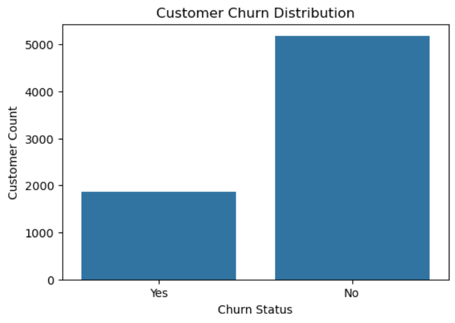
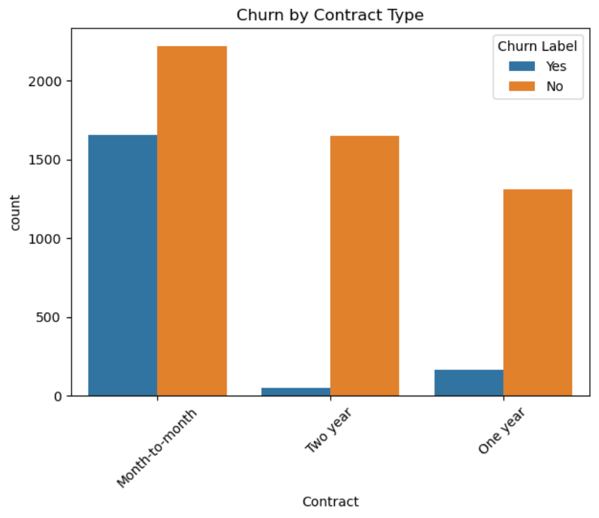
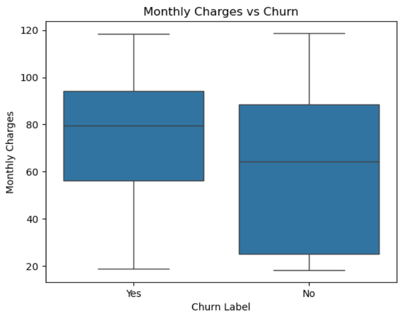
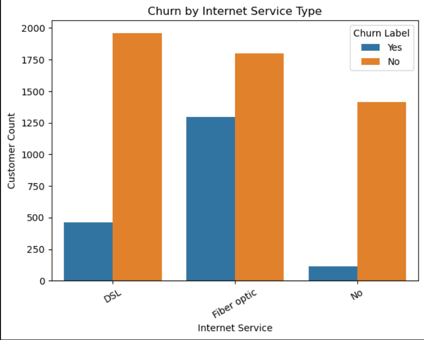
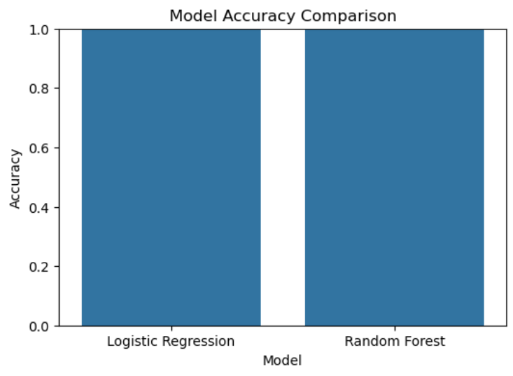
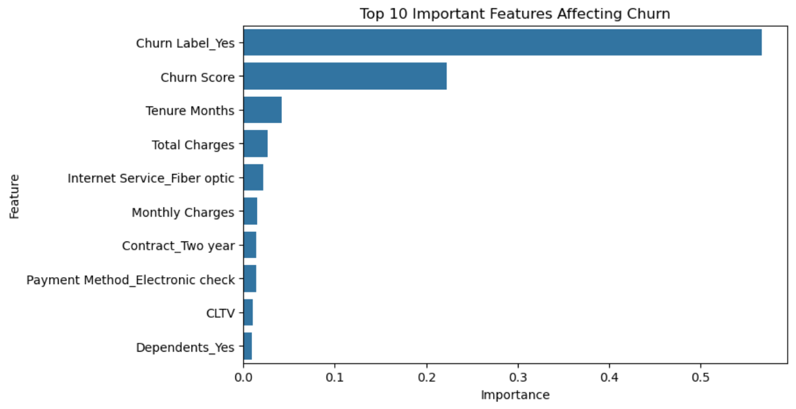

Project Description:
Analyzed telecom customer churn data using Python to identify churn patterns and build predictive models. Performed data cleaning, EDA, feature engineering, and trained Logistic Regression and Random Forest models to predict customer churn and generate actionable business insights.

Tools & Libraries:
Python
Pandas, NumPy
Matplotlib, Seaborn
Scikit-learn
Jupyter Notebook

Key Analysis Performed:
Churn distribution analysis
Contract type vs churn analysis
Monthly charges impact on churn
Internet service churn comparison
Feature importance extraction
Model performance comparison

Machine Learning Models:
Logistic Regression 
Random Forest Classifier 

Key Insights:
Fiber Optic customers show the highest churn rate
Month-to-month contract customers are more likely to churn
Higher monthly charges increase churn probability
Random Forest achieved better prediction performance

Visual Results:

Dataset Source:
IBM Telco Customer Churn Dataset (Public Dataset)

Author:
Anuj Sherekar
GitHub: https://github.com/AnujS10
